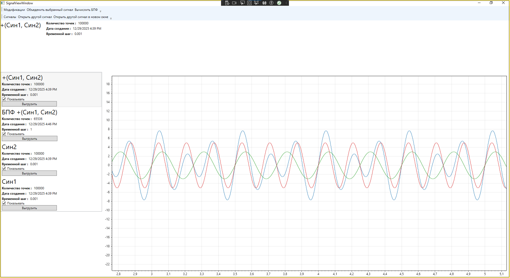
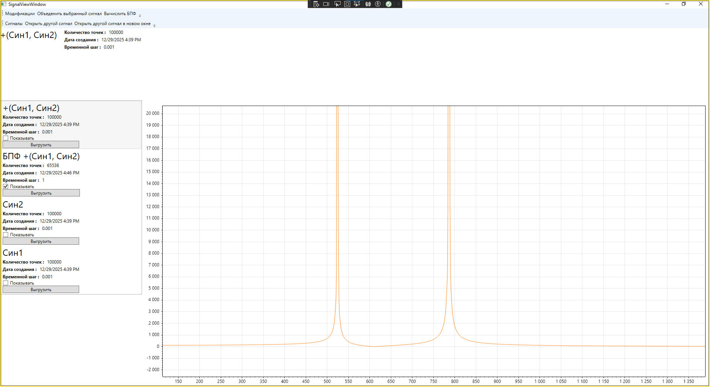

# Points

# Инструкция

## Требования
* **Система:** Windows 10 или выше.

## Установка
Необходимо скачать нужный бинарник из последнего релиза (TODO: Вставить ссылку)

## Управление графиком (предоставляется библиотекой)
Вращение колёсика мыши: приближение / отдаление

+шифт / +контрл: приближение по вертикали / горизонтали

ЛКМ для перемещения

Нажатие на колёсико мыши: сброс вьюпорта

## Инструменты

* БПФ: Создаёт новый график с частотами изначально выделенного графика. (желательно будет переделать на отдельное окно с информацией)

## Пример

Создание 2 синусоид (с частотой 6 и 4 единицы) и их объединение в одну (синюю) синусоиду

Получение БПФ в виде графика (амплитуды)

# Техническая информация

## Архитектура
Использую DI контейнеры для разрешения зависимостей, почти весь UI реализован через биндинги и ViewModel, почти всё согласно MVVM

## График
График рисуется через библиотеку ScottPlot, позволяя просматривать почти любое количество точек без каких либо тормозов

## Структура БД
База данных реализована через Entity Framework. 
Метаданные точек хранятся в таблице `SignalMeta`, сами данные о точках хранятся в `SignalChunks` в виде BLOB данных (по умолчнию чанк с размером в 1000 точек, 4000 байта)

## Тестирование
Система для тестирования имплементированно, однако на написание самих тестов времени не хватило. На текущий момент имплементировано всего пару тестов.

## Критические TODO
Моменты, на имплементацию которых у меня не хватило времени
* Необходимо оптимизировать `ChunkedList`, что бы избежать копирования при подгрузки данных влево (надо протестировать и про-профайлить линкед лист, влист, закольцёванный лист и прочие, тяжело сказать, что будет быстрее)
* Подгрузка происходит частично в UI потоке, что вызывает небольшие подтормаживания при подгрузки большого количества точек, почему то полный перенос в отдельный поток вызывает нулл чанки, надо отдебажить
* Абстрагировать `SignalViewViewModel` добавив возможность имплементации потоковых сигналов, рендера статистики (в том числе и БПФ) и предпросмотров модификаций.
* Возможность отмены генерации и чуть более корректный прогресс бар (часть нагрузки лежит на Entity Framework, который автоматически батчит сразу множество запросов, ускоряя работу с БД в несколько раз, имплементация батчинга в ручную может конфликтовать с батчингом внутри EF. Как вариант - ограничить максимальный и минимальный батчинг в параметрах EF и отталкиваться от него, но это может быть не самой лучшей практикой)
* Батчинг для подгрузки чанков (может ускорить подгрузку на масштабах от 500 тысяч точек раза в 2, скорее всего придётся реализовывать вручную)
* Дополнительные метаданные (возможность добавлять любые `ключ: значение` параметры к любому сигналу) и возможность редактировать их (включая возможность преименовывать сигнал)
* Создать единый кастомизируемый экран с настройками и загрузочным экраном для применения любых фильтров (по аналогии с миниокном параметров пресета из окна создания сигнала) и саму систему фильтров в принципе
* Добавить нормальную поддержку сигналов с количеством точек не кратным размеру чанка (сейчас он просто обрезает последний чанк)